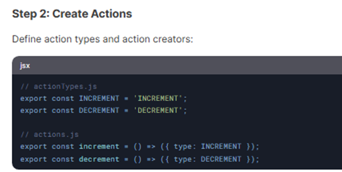

Absolutely, Ritik 👍
Here are **clean, structured NOTES on React Context — from BASIC → ADVANCED**, written in a way that is **easy to revise**, **interview-ready**, and **real-project oriented**.

---

# 📘 REACT CONTEXT – COMPLETE NOTES (Basic → Advanced)

---

## 1️⃣ What is React Context? (BASIC)

### 🔹 Definition

**React Context** is a way to **share data globally** between components **without passing props manually at every level**.

> Context solves the **prop drilling problem**.

---

### 🔹 Problem: Prop Drilling

```jsx
App
 └── Parent
      └── Child
           └── GrandChild (needs data)
```

Without Context:

```jsx
<App data={data}>
  <Parent data={data}>
    <Child data={data}>
      <GrandChild data={data} />
    </Child>
  </Parent>
</App>
```

❌ Messy
❌ Hard to maintain

---

### 🔹 Solution: Context

```jsx
<Context.Provider value={data}>
  <App />
</Context.Provider>
```

Now any component can access `data` directly.

---

## 2️⃣ Core Concepts of Context

| Term                    | Meaning           |
| ----------------------- | ----------------- |
| `createContext()`       | Creates a context |
| `Provider`              | Supplies data     |
| `Consumer / useContext` | Reads data        |

---

## 3️⃣ Creating Context (BASIC)

```js
import { createContext } from "react";

export const MyContext = createContext();
```

📌 Creates a **global container**

---

## 4️⃣ Provider (VERY IMPORTANT)

```jsx
<MyContext.Provider value={someData}>
  {children}
</MyContext.Provider>
```

### 🔹 What Provider Does

* Injects data into component tree
* Only components **inside Provider** can access context

---

## 5️⃣ Consuming Context (useContext)

```js
import { useContext } from "react";
import { MyContext } from "./MyContext";

const value = useContext(MyContext);
```

### 🔹 What happens internally?

1. React finds nearest Provider
2. Reads its `value`
3. Subscribes component to updates

---

## 6️⃣ When to Use Context?

✅ Auth (user, token)
✅ Theme (dark/light)
✅ Language
✅ Cart / Todo
❌ Local component state

---

## 7️⃣ Simple Context with useState (INTERMEDIATE)

### Example: Auth Context

```jsx
const AuthContext = createContext();

const AuthProvider = ({ children }) => {
  const [user, setUser] = useState(null);

  return (
    <AuthContext.Provider value={{ user, setUser }}>
      {children}
    </AuthContext.Provider>
  );
};
```

✔ Easy
✔ Clean
✔ Best for small state

---

## 8️⃣ Why NOT Always Use Context?

❌ Re-renders many components
❌ Hard to debug when large
❌ Not optimized for frequent updates

---

## 9️⃣ Context + useReducer (ADVANCED)

### When state logic becomes complex:

* Many actions
* Multiple updates
* Shared business rules

---

### Reducer Basics

```js
const reducer = (state, action) => {
  switch(action.type) {
    case "ADD":
      return [...state, action.payload];
    default:
      return state;
  }
};
```

📌 Reducer is:

* Pure function
* Predictable
* Centralized logic

---

### Using Reducer in Context

```jsx
const [state, dispatch] = useReducer(reducer, initialState);

<MyContext.Provider value={{ state, dispatch }}>
```

Now components **dispatch actions** instead of mutating state.

---

## 🔄 Context + Reducer Flow

```
Component
  ↓ dispatch(action)
Reducer
  ↓ new state
Provider
  ↓ updates context
All consumers re-render
```

---

## 1️⃣0️⃣ Action Object

```js
dispatch({
  type: "DELETE_TODO",
  payload: id
});
```

| Field     | Role        |
| --------- | ----------- |
| `type`    | Action name |
| `payload` | Data        |

---

## 1️⃣1️⃣ Why Context + Reducer is Powerful?

| Without Reducer     | With Reducer      |
| ------------------- | ----------------- |
| Logic in components | Logic centralized |
| Hard to scale       | Scalable          |
| Messy updates       | Predictable       |

---

## 1️⃣2️⃣ Custom Hook (BEST PRACTICE)

Instead of repeating:

```js
useContext(MyContext);
```

Create:

```js
export const useMyContext = () => {
  return useContext(MyContext);
};
```

✔ Cleaner
✔ Reusable
✔ Industry standard

---

## 1️⃣3️⃣ Side Effects in Context

Use `useEffect` for:

* localStorage
* API calls
* syncing data

```js
useEffect(() => {
  localStorage.setItem("user", JSON.stringify(user));
}, [user]);
```

---

## 1️⃣4️⃣ Performance Optimization (ADVANCED)

### 🔹 Problem

Context causes **all consumers to re-render**.

### 🔹 Solutions

* Split contexts
* Memoize values

```js
const value = useMemo(() => ({ state, dispatch }), [state]);
```

---

## 1️⃣5️⃣ Multiple Contexts

```jsx
<AuthProvider>
  <ThemeProvider>
    <App />
  </ThemeProvider>
</AuthProvider>
```

✔ Clean separation
✔ Scalable architecture

---

## 1️⃣6️⃣ Context vs Redux

| Context     | Redux            |
| ----------- | ---------------- |
| Built-in    | External library |
| Simple      | Powerful         |
| Medium apps | Large apps       |

📌 Context + Reducer ≈ Redux (basic)

---

## 1️⃣7️⃣ Common Mistakes 🚨

❌ Using context everywhere
❌ Mutating state
❌ Not wrapping Provider
❌ Huge single context

---

## 1️⃣8️⃣ Interview One-Liners 🎯

* **Context** avoids prop drilling
* **Reducer** handles state transitions
* **useContext** subscribes to context
* **Provider** supplies global state

---

## 1️⃣9️⃣ When NOT to use Context

❌ Highly frequent updates
❌ Large deeply nested changing data
❌ Performance-critical apps

---

## 2️⃣0️⃣ Final Summary

| Level        | Concept                      |
| ------------ | ---------------------------- |
| Basic        | createContext, Provider      |
| Intermediate | useContext, useState         |
| Advanced     | useReducer, custom hooks     |
| Expert       | Optimization, split contexts |

---

## 🧠 One Final Line (Memorable)

> **Context shares state, Reducer controls logic, Components stay clean.**

---

If you want:

* 📄 **Printable PDF notes**
* 🔥 **Redux Toolkit comparison**
* 🧪 **Mini interview questions**
* 🏗 **Real project architecture**

Just say 👍

## ------------ adding actions and action type in context -------
Ah, I see exactly what you’re asking 😄 — you’re wondering about your **action types** in your reducer (`"ADD"`, `"UPDATE"`, `"DELETE"`, `"TOGGLE"`) and whether **string literals** are okay, or you should define **constants** for them.

Let’s break it down.

---

## 1️⃣ Current Approach (String Literals)

```js
dispatch({ type: "ADD", payload: text });
dispatch({ type: "UPDATE", payload: { id, text } });
```

### ✅ Pros

* Simple
* Works fine for small projects
* Quick to read

### ❌ Cons

* Easy to make **typos** (e.g., `"ADD"` vs `"ADDD"`)
* Harder to refactor across a large project
* Not scalable for many actions

---

## 2️⃣ Better Approach: Define Constants

Create an `actionTypes.js`:

```js
export const ADD_TODO = "ADD";
export const UPDATE_TODO = "UPDATE";
export const DELETE_TODO = "DELETE";
export const TOGGLE_TODO = "TOGGLE";
```

Then import them:

```js
import { ADD_TODO, UPDATE_TODO, DELETE_TODO, TOGGLE_TODO } from "./actionTypes";

dispatch({ type: ADD_TODO, payload: text });
dispatch({ type: UPDATE_TODO, payload: { id, text } });
```

### ✅ Pros

* **Prevents typos**
* Easy to refactor (`replace all`)
* Scales to **medium/large apps**
* Standard practice in industry (Redux, Context + Reducer)

---

## 3️⃣ Updated Reducer Example

```js
import { ADD_TODO, UPDATE_TODO, DELETE_TODO, TOGGLE_TODO } from "./actionTypes";

export const todoReducer = (state, action) => {
  switch (action.type) {
    case ADD_TODO:
      return [...state, { id: Date.now(), text: action.payload, completed: false }];
    case UPDATE_TODO:
      return state.map(todo => todo.id === action.payload.id ? { ...todo, text: action.payload.text } : todo);
    case DELETE_TODO:
      return state.filter(todo => todo.id !== action.payload);
    case TOGGLE_TODO:
      return state.map(todo => todo.id === action.payload ? { ...todo, completed: !todo.completed } : todo);
    default:
      return state;
  }
};
```

---

## 4️⃣ How Components Will Use It

```js
import { useTodos } from "../hooks/useTodos";
import { ADD_TODO, UPDATE_TODO, DELETE_TODO, TOGGLE_TODO } from "../context/actionTypes";

dispatch({ type: ADD_TODO, payload: text });
dispatch({ type: DELETE_TODO, payload: todo.id });
```

---

## 5️⃣ Summary / Recommendation

| Approach                  | Pros                              | Cons                      |
| ------------------------- | --------------------------------- | ------------------------- |
| String literals (`"ADD"`) | Quick, simple                     | Error-prone, not scalable |
| Constants (`ADD_TODO`)    | Safe, scalable, industry standard | Slightly more code        |

✅ **Verdict:**
For **learning or small projects**, strings are okay.
For **real-world projects** or **anything moderately complex**, **use constants**.

---

If you want, I can **rewrite your entire Todo App with constants for actions** along with **custom `useTodos` hook**, so it becomes fully scalable and clean.

Do you want me to do that?

## -----------------  is this possible to dispatch(increse()) and in actionTypes.js -----------
Yes ✅ **this is 100% possible**, and it is actually a **BEST PRACTICE** pattern used in **Redux** and **Context + Reducer** setups.

Let’s break it down **clearly**, **step-by-step**, and remove all confusion.

---

# ✅ Short Answer

👉 **YES**, you can dispatch like this:

```js
dispatch(increment());
```

👉 And define `INCREMENT` inside `actionTypes.js`.

This works perfectly.

---

# 🧠 Why This Works

Because:

* `increment()` is an **action creator**
* It **returns an action object**
* `dispatch()` only cares about receiving an object like:

  ```js
  { type: "INCREMENT" }
  ```

---

# 🔹 Step-by-Step Explanation

## 1️⃣ `actionTypes.js`

This file only contains **constants**.

```js
export const INCREMENT = "INCREMENT";
export const DECREMENT = "DECREMENT";
```

### Why?

* Prevent typos
* Single source of truth
* Easy refactoring

---

## 2️⃣ `actions.js` (Action Creators)

```js
import { INCREMENT, DECREMENT } from "./actionTypes";

export const increment = () => ({
  type: INCREMENT,
});

export const decrement = () => ({
  type: DECREMENT,
});
```

### What is an Action Creator?

👉 A **function that returns an action object**

Instead of writing:

```js
dispatch({ type: "INCREMENT" });
```

You write:

```js
dispatch(increment());
```

✔ Cleaner
✔ Reusable
✔ Scalable

---

## 3️⃣ Reducer (`counterReducer.js`)

```js
import { INCREMENT, DECREMENT } from "./actionTypes";

export const counterReducer = (state, action) => {
  switch (action.type) {
    case INCREMENT:
      return state + 1;

    case DECREMENT:
      return state - 1;

    default:
      return state;
  }
};
```

📌 Reducer **does not know** about action creators
It only knows **action.type**

---

## 4️⃣ Dispatching in Component

```js
import { increment, decrement } from "../context/actions";
import { useCounter } from "../hooks/useCounter";

const { dispatch } = useCounter();

<button onClick={() => dispatch(increment())}>+</button>
<button onClick={() => dispatch(decrement())}>-</button>
```

✔ Clean
✔ Professional
✔ Industry-level pattern

---

# 🔄 Full Flow (IMPORTANT)

```
dispatch(increment())
        ↓
increment() returns { type: INCREMENT }
        ↓
dispatch receives action object
        ↓
reducer checks action.type
        ↓
new state returned
```

---

# 🆚 Comparison: With vs Without Action Creators

| Without Action Creators   | With Action Creators  |
| ------------------------- | --------------------- |
| dispatch({ type: "ADD" }) | dispatch(addTodo())   |
| Hardcoded strings         | Centralized constants |
| Error-prone               | Safe                  |
| Not scalable              | Scalable              |

---

# 🔥 When Should You Use Action Creators?

✅ Medium / Large apps
✅ Context + Reducer
✅ Redux / Redux Toolkit
✅ Shared actions

❌ Very small demos (optional)

---

# 🎯 Interview-Ready Answer

> “Yes, we can dispatch action creators like `dispatch(increment())`. Action creators return action objects, which are then handled by reducers using predefined action types.”

---

# ⚠️ Common Mistake to Avoid

❌ **This is WRONG**

```js
dispatch(increment); // ❌ function reference
```

✅ **Correct**

```js
dispatch(increment()); // ✅ function call
```

---

# ✅ Final Verdict

✔ **YES, it is possible**
✔ **YES, it is recommended**
✔ **YES, it scales well**

You are now using a **Redux-style professional architecture** inside **React Context** 👏

---

If you want next:

* 🔥 Convert your **Todo app** to this exact pattern
* 🔥 Add payload-based action creators
* 🔥 Async actions (API calls)
* 🔥 Compare with Redux Toolkit

Just say 🚀

## -------- give folder sctrure -----
Perfect 👍
Here is a **clean, scalable, industry-standard folder structure** for a **React Context + Reducer Todo App** using:

* ✅ Action Types
* ✅ Action Creators
* ✅ Reducer
* ✅ Context Provider
* ✅ Custom Hooks
* ✅ Component-based UI

This structure works for **small → large apps**.

---

# 📁 Recommended Folder Structure

```txt
src/
│
├── App.jsx
├── main.jsx
│
├── context/
│   └── todo/
│       ├── TodoContext.jsx
│       ├── TodoProvider.jsx
│       ├── todoReducer.js
│       ├── actionTypes.js
│       └── actions.js
│
├── hooks/
│   └── useTodos.js
│
├── components/
│   └── todo/
│       ├── TodoApp.jsx
│       ├── TodoInput.jsx
│       ├── TodoList.jsx
│       └── TodoItem.jsx
│
├── styles/
│   └── todo.css
│
└── utils/
    └── helpers.js
```

---

# 🧠 Folder-by-Folder Explanation

---

## 1️⃣ `context/todo/` → **State Management Layer**

This is the **brain** of the application.

### 📄 `TodoContext.jsx`

```js
import { createContext } from "react";
export const TodoContext = createContext();
```

👉 Creates global context.

---

### 📄 `TodoProvider.jsx`

```js
import { useReducer, useState } from "react";
import { TodoContext } from "./TodoContext";
import { todoReducer } from "./todoReducer";

export const TodoProvider = ({ children }) => {
  const [state, dispatch] = useReducer(todoReducer, []);
  const [editTodo, setEditTodo] = useState(null);

  return (
    <TodoContext.Provider value={{ state, dispatch, editTodo, setEditTodo }}>
      {children}
    </TodoContext.Provider>
  );
};
```

👉 Injects global state into component tree.

---

### 📄 `todoReducer.js`

```js
import { ADD_TODO, DELETE_TODO, UPDATE_TODO, TOGGLE_TODO } from "./actionTypes";

export const todoReducer = (state, action) => {
  switch (action.type) {
    case ADD_TODO:
      return [...state, action.payload];
    default:
      return state;
  }
};
```

👉 Handles state transitions.

---

### 📄 `actionTypes.js`

```js
export const ADD_TODO = "ADD_TODO";
export const DELETE_TODO = "DELETE_TODO";
export const UPDATE_TODO = "UPDATE_TODO";
export const TOGGLE_TODO = "TOGGLE_TODO";
```

👉 Central place for action names.

---

### 📄 `actions.js`

```js
import * as types from "./actionTypes";

export const addTodo = (text) => ({
  type: types.ADD_TODO,
  payload: {
    id: Date.now(),
    text,
    completed: false,
  },
});
```

👉 Action creators (dispatch helpers).

---

## 2️⃣ `hooks/` → **Custom Hooks Layer**

### 📄 `useTodos.js`

```js
import { useContext } from "react";
import { TodoContext } from "../context/todo/TodoContext";

export const useTodos = () => {
  return useContext(TodoContext);
};
```

👉 Clean access to context.

---

## 3️⃣ `components/todo/` → **UI Layer**

### 📄 `TodoApp.jsx`

```js
import TodoInput from "./TodoInput";
import TodoList from "./TodoList";

export default function TodoApp() {
  return (
    <>
      <h1>Todo App</h1>
      <TodoInput />
      <TodoList />
    </>
  );
}
```

👉 Container component.

---

### 📄 `TodoInput.jsx`

👉 Handles add/update UI
👉 Dispatches actions

---

### 📄 `TodoList.jsx`

👉 Iterates todos

---

### 📄 `TodoItem.jsx`

👉 Single todo UI
👉 Dispatch delete / toggle

---

## 4️⃣ `hooks vs context` (IMPORTANT)

| Hooks        | Context       |
| ------------ | ------------- |
| Access logic | State storage |
| Clean API    | Global store  |
| Reusable     | Shared        |

---

## 5️⃣ `App.jsx`

```js
import { TodoProvider } from "./context/todo/TodoProvider";
import TodoApp from "./components/todo/TodoApp";

function App() {
  return (
    <TodoProvider>
      <TodoApp />
    </TodoProvider>
  );
}

export default App;
```

👉 Provider wraps app.

---

## 6️⃣ Why This Structure Is GOOD

✅ Separation of concerns
✅ Scales easily
✅ Easy to test
✅ Industry-level
✅ Redux-like architecture

---

## 🎯 Interview One-Liner

> “I follow a feature-based folder structure where context handles state, reducers manage logic, hooks abstract access, and components focus only on UI.”

---

## 🚀 Next Level (Optional Enhancements)

* Add `AuthContext`
* Persist todos to localStorage
* Add middleware logging
* Convert to Redux Toolkit later

---

If you want, I can:

* 📄 Draw **data flow diagram**
* 🔥 Convert to **Redux Toolkit**
* 🧪 Add **unit tests**
* 🏗 Make it **production-ready**

Just tell me 👍

## --------------- so what is diffrence her with actions.js file and todoReducer.js ----------
This is a **very important question** 👍
Most people copy this pattern without truly understanding it — you’re doing the right thing by asking.

Let’s **clearly separate the roles** of **`actions.js`** and **`todoReducer.js`**, with **mental models, flow diagrams, and real examples**.

---

# 🧠 Short Answer (One-liner)

> **`actions.js` describes *WHAT* happened,
> `todoReducer.js` decides *HOW* state should change.**

---

# 1️⃣ `actions.js` — *Action Creators Layer*

### 📄 Example

```js
export const addTodo = (text) => ({
  type: "ADD_TODO",
  payload: {
    id: Date.now(),
    text,
    completed: false
  }
});
```

### 🔹 What does this file do?

* Creates **action objects**
* Contains **NO state logic**
* Only prepares **messages** for reducer

📌 Think of it as:

> 📝 “Request forms”

---

### 🔹 Why do we need it?

Without `actions.js`:

```js
dispatch({
  type: "ADD_TODO",
  payload: { id: Date.now(), text }
});
```

With `actions.js`:

```js
dispatch(addTodo(text));
```

✔ Cleaner
✔ Reusable
✔ No duplication
✔ Easy refactor

---

### 🔹 What should NOT be here?

❌ No `state`
❌ No `map`, `filter`
❌ No business logic

---

# 2️⃣ `todoReducer.js` — *State Logic Layer*

### 📄 Example

```js
export const todoReducer = (state, action) => {
  switch (action.type) {
    case "ADD_TODO":
      return [...state, action.payload];

    case "DELETE_TODO":
      return state.filter(todo => todo.id !== action.payload);

    default:
      return state;
  }
};
```

### 🔹 What does this file do?

* Receives:

  * current `state`
  * dispatched `action`
* Returns **new state**

📌 Think of it as:

> 🧠 “Decision maker”

---

### 🔹 Why reducer must be pure?

* No API calls
* No side effects
* Predictable output

Same input → same output

---

# 3️⃣ How They Work Together (VERY IMPORTANT)

### 🔄 Flow Diagram

```
Component
   ↓
dispatch(addTodo("Learn Context"))
   ↓
actions.js returns:
{ type: "ADD_TODO", payload: {...} }
   ↓
todoReducer(state, action)
   ↓
newState returned
   ↓
Context updates UI
```

---

# 4️⃣ Side-by-Side Comparison

| Aspect             | actions.js     | todoReducer.js |
| ------------------ | -------------- | -------------- |
| Responsibility     | Create actions | Update state   |
| Knows about state? | ❌ No           | ✅ Yes          |
| Contains logic?    | ❌ No           | ✅ Yes          |
| Pure function?     | ✅ Yes          | ✅ Yes          |
| Reusable?          | ✅ Yes          | ❌ No           |
| Called by          | Component      | React          |

---

# 5️⃣ Real-World Analogy 🏢

| App              | Office       |
| ---------------- | ------------ |
| Component        | Employee     |
| `actions.js`     | Request Form |
| `dispatch()`     | Submit form  |
| `todoReducer.js` | Manager      |
| State            | Company data |

Employee:

```js
dispatch(addTodo("Task"))
```

Manager decides:

* Add
* Update
* Reject

---

# 6️⃣ Why Split Them?

### ❌ Without separation

* Huge reducer
* Hard to test
* Hard to reuse

### ✅ With separation

* Clean architecture
* Scalable
* Easy debugging

---

# 7️⃣ When You Can SKIP `actions.js`

✔ Small demos
✔ Learning phase
✔ 2–3 actions

Example:

```js
dispatch({ type: "ADD" });
```

---

# 8️⃣ When `actions.js` is REQUIRED

✅ Medium / large apps
✅ Multiple components dispatching same action
✅ Team projects
✅ Redux migration later

---

# 🎯 Interview-Perfect Answer

> “`actions.js` contains action creators that define what happened, while `todoReducer.js` contains reducer logic that determines how the state changes in response to those actions.”

---

# 🔥 Final Summary (Memorable)

> **Actions describe the event.
> Reducers decide the result.**

---

If you want next:

* 🔥 Convert your Todo fully to **Redux Toolkit**
* 🔥 Add **async actions**
* 🔥 Add **logging middleware**
* 🔥 Add **tests for reducer**

Just say 👍


## ------------ with counter ----------
Excellent question 👍
This shows you’re **thinking like a real Redux developer now**.

---

## ❓ Why is there **NO payload** in counter actions?

### Short answer:

👉 **Because the reducer already knows *how much* to change the state by.**

---

## 🔍 Let’s understand with logic

### Current reducer logic (example):

```js
case COUNT_INCREASE:
  return state + 1;

case COUNT_INCREASE_BY_FIVE:
  return state + 5;
```

Here:

* The **action type itself defines the behavior**
* No extra data is required
* So **payload is unnecessary**

✔ Clean
✔ Simple
✔ Readable

---

## 🧠 Rule of Thumb (VERY IMPORTANT)

### ✅ Use **NO payload** when:

* The change is **fixed**
* The reducer knows the exact update

Examples:

```js
+1
-1
reset to 0
+5
-5
```

---

## ❌ When payload IS required

### Example: dynamic values

```js
dispatch(increaseByValue(10));
dispatch(increaseByValue(3));
```

### Action

```js
export const increaseByValue = (value) => ({
  type: "INCREASE_BY_VALUE",
  payload: value,
});
```

### Reducer

```js
case "INCREASE_BY_VALUE":
  return state + action.payload;
```

👉 Here, reducer **cannot guess the value**, so payload is needed.

---

## 🔁 Two Valid Counter Designs

### 🔹 **Design 1: Fixed Actions (Your Current Code) – RECOMMENDED for beginners**

```js
dispatch(countIncrease());       // +1
dispatch(countIncreaseByFive()); // +5
dispatch(countReset());          // 0
```

✔ No payload
✔ Easy to read
✔ Less bugs

---

### 🔹 **Design 2: Dynamic Action (Advanced / Scalable)**

```js
dispatch(changeCount(7));
dispatch(changeCount(-3));
```

Action:

```js
export const changeCount = (value) => ({
  type: "CHANGE_COUNT",
  payload: value,
});
```

Reducer:

```js
case "CHANGE_COUNT":
  return state + action.payload;
```

✔ Flexible
❌ Slightly less explicit

---

## 🧪 Interview Question Ready Answer

> **Why don’t we pass payload in some Redux actions?**

✅ *When the state change is deterministic and known beforehand, the reducer doesn’t require extra data. The action type alone is sufficient to describe the state transition.*

💯 This answer scores points.

---

## 🧩 Why this is GOOD practice

* Less boilerplate
* Clear intent
* Easier debugging in Redux DevTools
* Smaller action objects

---

## ⚠️ Common Beginner Mistake

❌ Always passing payload even when not needed
❌ Overengineering simple logic

---

### 🚀 Summary

| Situation                 | Payload Needed? |
| ------------------------- | --------------- |
| Fixed increment/decrement | ❌ No            |
| Reset                     | ❌ No            |
| Dynamic value             | ✅ Yes           |
| API response              | ✅ Yes           |
| Form input                | ✅ Yes           |

---

If you want, next I can:

* Convert this to **Redux Toolkit (createSlice)**
* Show **real-world counter with API**
* Explain **useReducer vs Redux**

Just say the word 👍

## ---------- experiment -------
here can we chnage the const [count, dispatch] = useReducer(counterReducer, 0);
as const [dispatch, count ] = useReducer(counterReducer, 0); if yes then for dispatcing the state how we should to do if no then why

Optimizing tool selection...No, you cannot change `const [count, dispatch] = useReducer(counterReducer, 0);` to `const [dispatch, count] = useReducer(counterReducer, 0);` because `useReducer` always returns an array in the format `[state, dispatch]`, where the first element is the current state (in this case, `count`) and the second element is the `dispatch` function. Swapping them would assign the state to `dispatch` and the dispatch function to `count`, which would break your code:

- `count` would become a function (the dispatch function), not a number, so you couldn't display or use it as a counter value.
- `dispatch` would become the state value (the number), so you couldn't call it to trigger state updates.

For dispatching actions, you would still call `dispatch(action)` as usual (e.g., `dispatch({ type: 'INCREMENT' })`), but only if the destructuring is correct. If you swapped it, `dispatch` wouldn't be a function anymore, leading to runtime errors.

If you want to rename or reorder for clarity, you could destructure differently (e.g., `const [state, setState] = useReducer(counterReducer, 0);` and then rename `state` to `count` in the context value), but the order must match what `useReducer` returns. The current setup is standard and correct.

# --------- so i change the the dispatch to setCounter--
Optimizing tool selection...

Using "Replace String in File"


```

```


Using "Replace String in File"


```

```


Searched for text `dispatch`, 20 results

Read [](file:///d%3A/Extra-Tech/React-Js-full-notes/react-all-code-ccbp/Practies_Folder/ContextAPI/3_todo_context_with_action_type/src/components)

Read [](file:///d%3A/Extra-Tech/React-Js-full-notes/react-all-code-ccbp/Practies_Folder/ContextAPI/3_todo_context_with_action_type/src/components/counter)

Read [](file:///d%3A/Extra-Tech/React-Js-full-notes/react-all-code-ccbp/Practies_Folder/ContextAPI/3_todo_context_with_action_type/src/components/counter/Counter.jsx)

Using "Replace String in File"


```

```


Using "Replace String in File"


```

```


Read [](file:///d%3A/Extra-Tech/React-Js-full-notes/react-all-code-ccbp/Practies_Folder/ContextAPI/3_todo_context_with_action_type/src/components/todo)

Searched for text `CounterContext` (`**/ContextAPI/3_todo_context_with_action_type/src/components/todo/**/*`), no results

Using "Replace String in File"


```

```


Read [](file:///d%3A/Extra-Tech/React-Js-full-notes/react-all-code-ccbp/Practies_Folder/ContextAPI/3_todo_context_with_action_type/package.json#1-1), lines 1 to 20

Ran terminal command: cd "d:\Extra-Tech\React-Js-full-notes\react-all-code-ccbp\Practies_Folder\ContextAPI\3_todo_context_with_action_type" && npm test -- --watchAll=false

Ran terminal command: cd "d:\Extra-Tech\React-Js-full-notes\react-all-code-ccbp\Practies_Folder\ContextAPI\3_todo_context_with_action_type"; npm test -- --watchAll=false

The changes have been successfully applied! I've renamed `dispatch` to `setCounter` in:

- **CounterProvider.jsx**: Updated the destructuring and context value.
- **Counter.jsx**: Updated the context consumption and all button `onClick` handlers to use `setCounter` instead of `dispatch`.
- Updated the comments in CounterProvider.jsx for consistency.

The app should now work the same way, but with the more conventional naming. If you run the app (`npm start` in the project folder), the counter buttons should still increment/decrement/reset the count as expected. Let me know if you need any further adjustments!

Made changes.